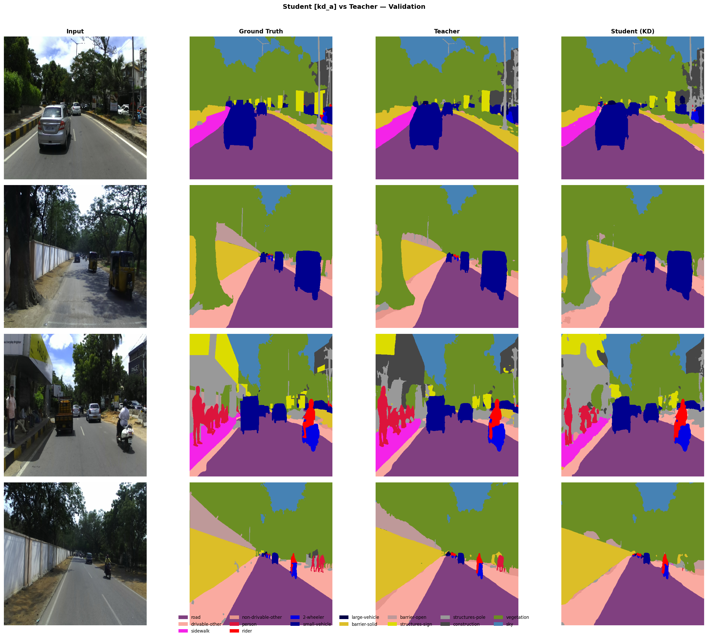
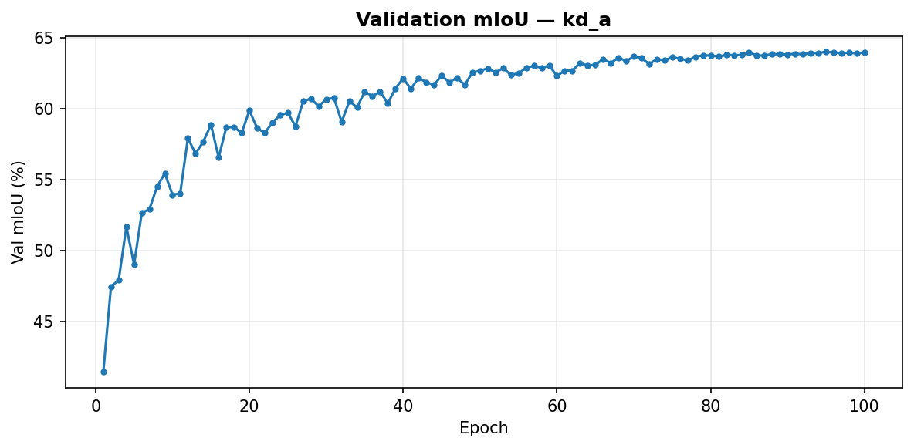
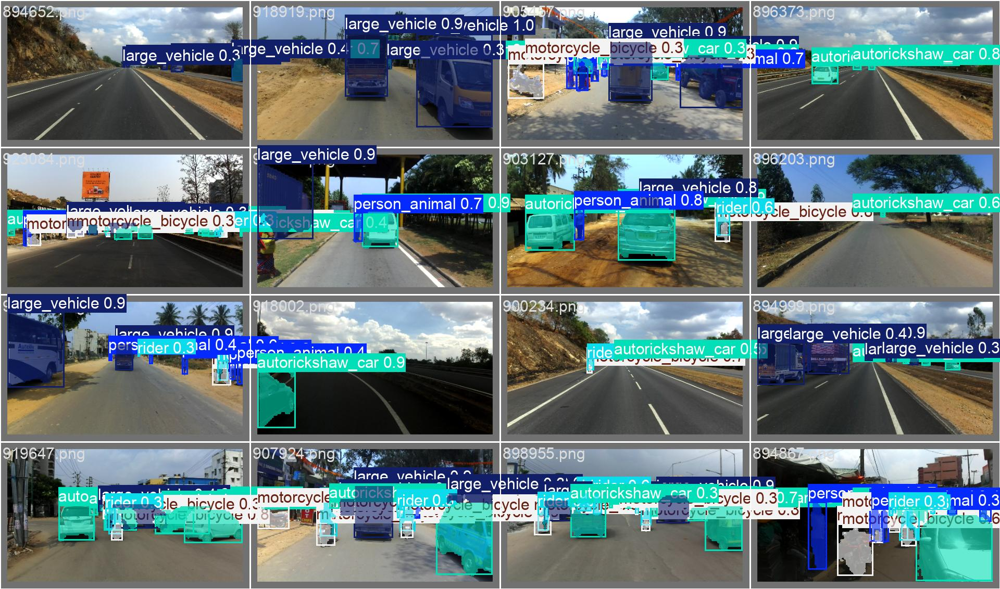
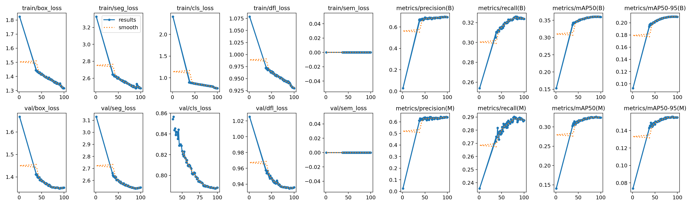

# Real-Time Semantic and Instance Segmentation for Real-World Driving Environments


An end-to-end **Edge AI road-scene perception pipeline** built on the **India Driving Dataset (IDD)**, combining dense semantic segmentation with **YOLOv8n-seg instance segmentation** for dynamic road users — trained, distilled, and deployed on a **Raspberry Pi with a Hailo accelerator**.

---

## Highlights

- **End-to-end edge AI pipeline** — Raw polygon annotations are converted into masks, models are trained, compiled for Hailo, and deployed on Raspberry Pi.
- **Hybrid perception system** — Semantic segmentation handles dense road layout understanding, while YOLOv8n-seg provides object-level masks for dynamic road users.
- **Multiple semantic deployment models** — Three Hailo semantic models are available for different speed/accuracy trade-offs.
- **Logit knowledge distillation** — Compact student models are trained using softened teacher predictions to improve edge-device performance.
- **Hailo-ready deployment** — Final `.hef` weights are included for the Raspberry Pi demo.


---

## Repository Structure

```text
.
├── dataset_preprocessing/      # IDD polygon JSON → semantic/instance mask conversion
├── training_code/              # Semantic baseline, logit KD, and YOLOv8n-seg training
├── hailo_compilation/          # ONNX export and Hailo compile scripts
├── rpi_deployment/             # Raspberry Pi demo script and HEF weights
├── docs/images/                # README images and visual examples
└── README.md                   # Project overview and documentation
```

Each top-level folder contains its own `requirements.txt` and README.md .


## The Hailo Accelerator

The **Hailo AI accelerator** is a purpose-built neural network inference chip designed for edge devices. Unlike a general-purpose CPU or even a GPU, the Hailo chip executes only inference workloads and is optimised at the silicon level for the data movement patterns of convolutional neural networks. On a Raspberry Pi — which has no discrete GPU — the Hailo accelerator serves as the dedicated inference engine, offloading model execution entirely from the Pi's ARM CPU.

---

## Model Compression: PyTorch Checkpoint → HEF

Getting a PyTorch model to run efficiently on the Hailo chip requires a multi-stage compilation and compression pipeline. Each step reduces the model's footprint and adapts it to the constraints of the target hardware.

```
PyTorch checkpoint (.pth / .pt)
  → ONNX               # hardware-agnostic portable inference graph
  → HAR                # Hailo Archive: graph parsed and mapped to Hailo ops
  → Optimized HAR      # post-training quantization applied (FP32 → INT8)
  → HEF                # Hailo Executable Format: compiled binary for the chip
```


The most significant compression step is **post-training quantization (PTQ)**, applied during the HAR → Optimized HAR stage. The Hailo Dataflow Compiler uses a small calibration dataset — representative input images — to estimate the distribution of activations throughout the network, then converts all weights and activations from 32-bit floating point (FP32) to 8-bit integers (INT8). This reduces model size by approximately **4×** and enables the Hailo chip to use its fast integer arithmetic units, which are substantially more power-efficient than floating-point computation.

Beyond quantization, the Hailo compiler also performs **operator fusion** — merging sequences of operations such as convolution + batch norm + activation into single hardware primitives — and schedules the resulting computation graph across the chip's internal dataflow architecture to maximise parallelism and minimise memory traffic. The final HEF binary is a fully compiled, hardware-specific executable loaded directly by HailoRT on the device.

The compression achieved across all four deployed models:

| Model | Architecture | FP32 size (est.) | HEF size | Compression |
|-------|-------------|---------------:|--------:|:-----------:|
| Model 1 | MobileNetV4-S + LR-ASPP | ~5.4 MiB | 1.34 MiB | ~4× |
| Model 2 | MobileNetV4-L + DeepLabV3+ | ~177.4 MiB | 6.60 MiB | ~20× |
| Model 3 | MobileNetV4-S + DeepLabV3+ | ~39.7 MiB | 9.93 MiB | ~4× |
| YOLOv8n-seg | YOLOv8n-seg | ~28.3 MiB | 7.07 MiB | ~4× |

---

## Motivation

Autonomous and assisted driving systems must reliably interpret road scenes under challenging real-world conditions. Indian traffic environments present a particularly demanding setting due to dense, unstructured layouts; wide variation in vehicle types and object scales; frequent occlusions and mixed traffic; and complex scene categories spanning road surfaces, sidewalks, barriers, vegetation, construction zones, riders, two-wheelers, and large commercial vehicles.

Cloud-based perception is incompatible with the latency requirements of embedded systems. This project develops a perception stack that runs entirely on edge hardware, delivering real-time semantic and instance-level scene understanding without relying on remote compute.

---

## Project Objectives

The system is designed to:

- Train semantic segmentation models across multiple label granularities
- Apply logit knowledge distillation to produce compact, high-quality student models
- Train a YOLOv8n-seg model for dynamic foreground object instance segmentation
- Convert all trained models into Hailo-compatible HEF files via PTQ-based compilation
- Run a live Raspberry Pi demo with semantic overlay, YOLO overlay, and on-the-fly model switching

---

## Hardware and Software

### Hardware

- Raspberry Pi
- Hailo AI accelerator
- Camera or video input source
- Development machine or WSL2 environment (for Hailo compilation)

### Software and Tools

- Python, PyTorch, TorchVision, TIMM
- Ultralytics YOLO, OpenCV, PyQt5
- Hailo Dataflow Compiler, HailoRT
- Jupyter Notebook

---

## Dataset Preprocessing

**Dataset link:** https://idd.insaan.iiit.ac.in/dataset/details/

The IDD dataset provides road scene images captured across Indian cities, annotated with fine-grained polygon labels covering a rich set of scene categories. The preprocessing notebook `dataset_preprocessing/idd_polygon_to_masks_preprocessing.ipynb` converts these raw polygon JSON annotations into dense pixel masks suitable for training segmentation models.

The main entry point is:

```python
run_pipeline(
    datadir,
    out_basedir,
    encoding,
    do_semantic,
    do_instance,
    do_color,
    do_panoptic,
)
```

Supported label encodings:

| Encoding | Description |
|----------|-------------|
| `level1Id` | 7-class coarse semantic labels |
| `level2Id` | 16-class labels used for deployment |
| `level3Id` | 26-class fine semantic labels |
| `id`, `csId`, `csTrainId`, `level4Id`, `unifiedId` | Alternate encodings |

The deployed system uses `level2Id` — 16 classes that strike a practical balance between scene coverage and class frequency, well-suited for training compact models. Expected directory layout after conversion:

```text
IDDL2/
  train/
    images/
    masks/
  val/
    images/
    masks/
  test/
    images/
    masks/
```

Semantic masks use class IDs from `0` to `C−1`. The value `255` is reserved as the ignore label and is excluded from loss computation during training.

---

## Semantic Segmentation Models

The semantic branch produces a dense per-pixel class prediction over the full image, assigning each pixel one of 16 road-scene categories. This gives the system a holistic understanding of scene layout — road surface, footpaths, barriers, vegetation, sky, buildings, and more — serving as the primary scene context layer in the deployed pipeline.

Four architectures are evaluated, spanning a range from ultra-lightweight deployment models to a powerful teacher network:

| Model | Architecture | Role |
|-------|-------------|------|
| Model 1 | MobileNetV4-S + LR-ASPP | Smallest semantic deployment model |
| Model 2 | MobileNetV4-L + DeepLabV3+ | Higher-accuracy semantic deployment model |
| Model 3 | MobileNetV4-S + DeepLabV3+ | Balanced semantic deployment model |
| Teacher | ConvNeXt-Base + UPerNet | Strong teacher for knowledge distillation |

MobileNetV4 backbones are chosen for their excellent accuracy-to-latency ratio on constrained hardware. LR-ASPP and DeepLabV3+ heads offer different trade-offs: LR-ASPP is extremely lightweight while DeepLabV3+ uses atrous spatial pyramid pooling for stronger multi-scale context at a moderate cost increase.

The semantic branch predicts **16 Label2ID classes** for the deployed system.



---

## Logit Knowledge Distillation

All deployment models are trained using **logit knowledge distillation (logit KD)**, where the student learns from both the ground-truth labels and the softened output distribution of the ConvNeXt-Base + UPerNet teacher. The training objective is:

```
loss = CE(student_logits, labels) + α · KL(teacher_logits / T, student_logits / T)
```

where `T = 4.0` (distillation temperature) and `α = 1.0` (distillation weight).



---

## YOLOv8n-Seg Instance Segmentation

While the semantic branch provides dense scene-level understanding, it treats all pixels of a given class as a single undifferentiated region. To get object-level awareness — knowing not just that a region contains riders, but precisely which pixels belong to which individual rider — the system adds a **YOLOv8n-seg instance segmentation** branch.

YOLOv8n-seg runs concurrently with the semantic model on the Hailo chip, detecting and segmenting five foreground categories covering the dynamic road users most relevant to collision avoidance and path planning:

| ID | Class |
|----|-------|
| 0 | person_animal |
| 1 | rider |
| 2 | motorcycle_bicycle |
| 3 | vehicle |
| 4 | large_vehicle |

These classes are deliberately broader than standard COCO categories, reflecting the vehicle taxonomy of IDD and reducing class imbalance across Indian traffic scenes.






---

## Training Results

**Semantic segmentation:**

| Deployment Model | Architecture | Label2 mIoU |
|-----------------|-------------|------------:|
| Model 1 | MobileNetV4-S + LR-ASPP | 59.67 |
| Model 2 | MobileNetV4-L + DeepLabV3+ | 68.15 (with logit KD) |
| Model 3 | MobileNetV4-S + DeepLabV3+ | 63.99 (with logit KD) |

**HEF deployment artifacts and Raspberry Pi benchmarks:**

| File | Model | HEF Size | FPS on RPi |
|------|-------|--------:|----------:|
| `rpi_deployment/weights/model1_hailo.hef` | Model 1 semantic | 1.34 MiB | 16.7 |
| `rpi_deployment/weights/model2_hailo.hef` | Model 2 semantic | 6.60 MiB | 8.8 |
| `rpi_deployment/weights/model3_hailo.hef` | Model 3 semantic | 9.93 MiB | 14.6 |
| `rpi_deployment/weights/yolov8n_seg_hailo.hef` | YOLOv8n-seg | 7.07 MiB | −2 FPS overhead on semantic models |

> The YOLO model runs concurrently with the active semantic model via the pipelined demo script. The reported overhead reflects the reduction in effective FPS when both models are active simultaneously.

---

## Hailo Compilation

The compilation code is in `hailo_compilation/`. The full pipeline is described in the [Model Compression](#model-compression-pytorch-checkpoint--hef) section above. Generated ONNX, HAR, optimized HAR, calibration tensors, and compiler logs are not included in this repository. Place your own checkpoint in the relevant model folder before running the export and compile scripts.

```bash
cd hailo_compilation/semantic_model3_mbv4small_deeplabv3p
python export_onnx.py
python prep_calib.py --images /path/to/calibration/images --out calib_set.npy
bash hailo_compile.sh
```

---

## Raspberry Pi Deployment

The deployment code is in `rpi_deployment/`. The demo script loads one or more HEF files into HailoRT, streams frames from a camera or video file, runs inference on the Hailo chip, and renders the segmentation overlay in real time using OpenCV and PyQt5.

```bash
cd rpi_deployment
pip install -r requirements.txt
python python_if_models_switch_pipelined.py
```


**Benchmark mode:**

```bash
python python_if_models_switch_pipelined.py --benchmark /path/to/video.mp4 300
```

The application supports:

- Video file and live camera input
- On-the-fly semantic model switching (Model 1 / 2 / 3)
- YOLO instance overlay toggle
- Overlay alpha blending control
- Hailo HEF inference via HailoRT

### Example — running in real time on a Raspberry Pi


---

## Quick Start(More finer instruction are inside each folder's README.md)

### 1. Preprocess IDD

```bash
cd dataset_preprocessing
pip install -r requirements.txt
jupyter notebook idd_polygon_to_masks_preprocessing.ipynb
```

### 2. Train semantic models

```bash
cd training_code/original_mbv4_teacher_student
pip install -r requirements.txt
python train_teacher.py
python train_baseline.py
python train_logit_kd.py
```

For other student folders:

```bash
python train_logit_kd.py
```

### 3. Train YOLO

```bash
cd training_code/yolov8n_instance_seg
pip install -r requirements.txt
python scripts/prepare_dataset_bridge.py
python train_yolov8n_seg.py
```

### 4. Compile for Hailo

Use Ubuntu under WSL2 or a native Linux environment with the Hailo Dataflow Compiler installed.

```bash
cd hailo_compilation
pip install -r requirements.txt
```

Then enter the target model folder and run its export and compile scripts.

### 5. Run on Raspberry Pi

```bash
cd rpi_deployment
pip install -r requirements.txt
python python_if_models_switch_pipelined.py
```

---

## Future Work

- Larger and more representative calibration sets for improved Hailo PTQ quantization accuracy
- Improved mask quality using temporal smoothing across frames
- Additional semantic classes and panoptic fusion experiments
- Introduce Re-ID for better tracking of individual instance objects across frames

---

## Disclosure: Portions of this codebase were developed with the assistance of large language model (LLM) tools. All generated code was reviewed, tested, and validated by the project team.

## Team

| Name | Role |
|------|------|
| Debanshu Mallick | Project member |
| Chandan Rai | Project member |
| Tamaghna Mandal | Project member |
| Yuvaraj DC | Project member |

**Mentor / Supervisor:** Pandarasamy Arjunan — RBCCPS, Indian Institute of Science | Website: https://www.samy101.com/edge-ai-26/
